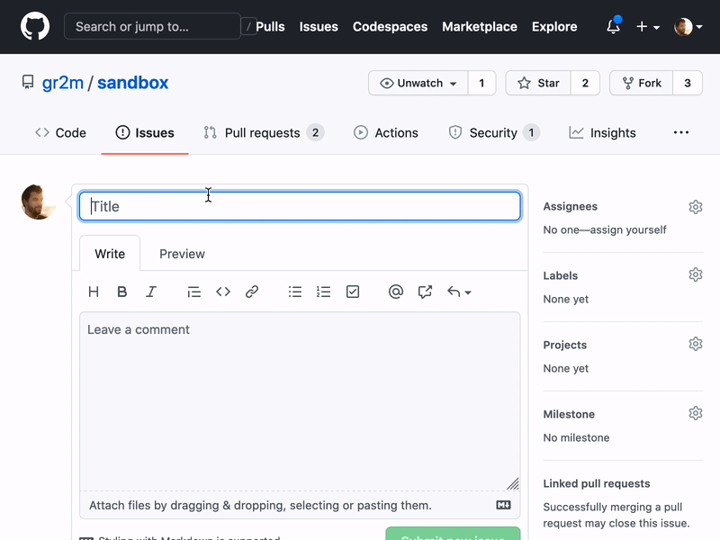

# cloudflare-worker-github-app-example

> A Cloudflare Worker + GitHub App Example

The [worker.js](worker.js) file is a [Cloudflare Worker](https://workers.cloudflare.com/) which is continuously deployed using GitHub Actions (see [.github/workflows/deploy.yml](.github/workflows/deploy.yml)).

The worker does 2 things

1. `GET` requests: respond with an HTML website with links and a live counter of installations.
2. `POST` requests: handle webhook request from GitHub

⚠️ The requests from GitHub are currently not verified using the signature, because [the code is currently using Node's crypto package](https://github.com/octokit/webhooks.js/blob/0e03e470034ac769a28ed37acb524b94e304bf96/src/sign/index.ts#L1). This will be resolved once I create a universal webhook verification package, similar to [`universal-github-app-jwt`](https://github.com/gr2m/universal-github-app-jwt/#readme). For the time being, you could define a secret path that that webhook requests by GitHub are sent to, in order to prevent anyone who knows your workers URL from sending fake webhook requests. See [#1](https://github.com/gr2m/cloudflare-worker-github-app-example/issues/1)



## Step-by-step instructions to create your own

Note that you require access to the new GitHub Actions for the automated deployment to work.

1. Fork this repository
1. [Create a GitHub App](https://developer.github.com/apps/building-github-apps/creating-a-github-app/)
1. [Create a Cloudflare account](https://dash.cloudflare.com/) (it's free!) if you don't have one yet.
1. Install the `wrangler` CLI and login with your account

   ```
   npm install --global wrangler
   wrangler login
   ```

1. Edit the `wrangler.toml` file, change the value for `account_id` to your own ([select your account](https://dash.cloudflare.com/), then find your Account ID at the bottom of the side bar)
1. Add the following secrets to your Cloudflare worker:

   - `APP_ID`: In your GitHub App registration's settings page, find `App ID`

     ```
     wrangler secret put APP_ID
     ```

   - `WEBHOOK_SECRET`: In your GitHub App registration's settings page, find `Webhook secret`

     ```
     wrangler secret put WEBHOOK_SECRET
     ```

   - `PRIVATE_KEY`: Generate a private key (see the button at the bottom of your GitHub App registration's settings page).

     1. You will be prompted to download a `*.pem` file. After download, rename it to `private-key.pem`.
     1. Convert the key from the `PKCS#1` format to `PKCS#8` (The WebCrypto API only supports `PKCS#8`):

        ```
        openssl pkcs8 -topk8 -inform PEM -outform PEM -nocrypt -in private-key.pem -out private-key-pkcs8.pem
        ```

     1. Write the contents of the new file into the secret `PRIVATE_KEY`:

        ```
        cat private-key-pkcs8.pem | wrangler secret put PRIVATE_KEY
        ```

1. Add the following secret in your fork's repository settings:
   - `CF_API_TOKEN`: [Create a new token](https://dash.cloudflare.com/profile/api-tokens), use the "Edit Cloudflare Workers" template

That should be it. The `worker.js` file will now be continously deployed to Cloudflare each time there is a commit to master.

## See also

- [Cloudflare Worker GitHub OAuth Example](https://github.com/gr2m/cloudflare-worker-github-oauth-login/#readme)

## Credits

The OAuth App Avatar and this repository's social preview are using [@cameronmcefee](https://github.com/cameronmcefee)'s [cloud](https://octodex.github.com/cloud/) Octodex graphic :octocat:💖

## License

[ISC](LICENSE)
